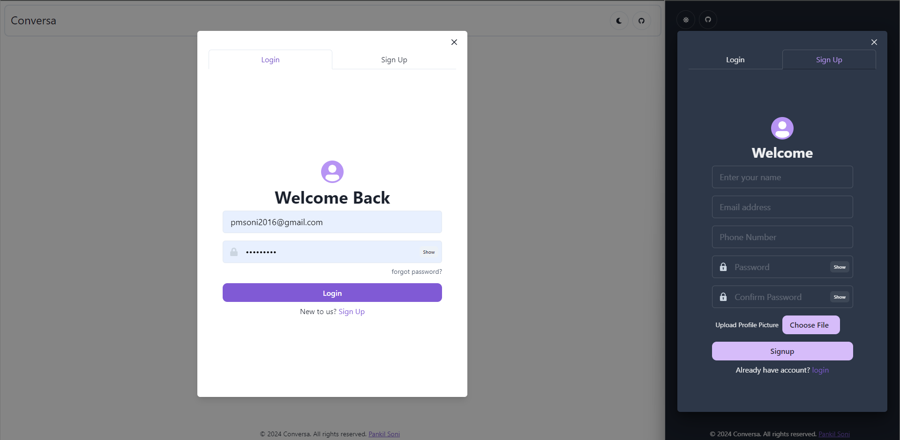
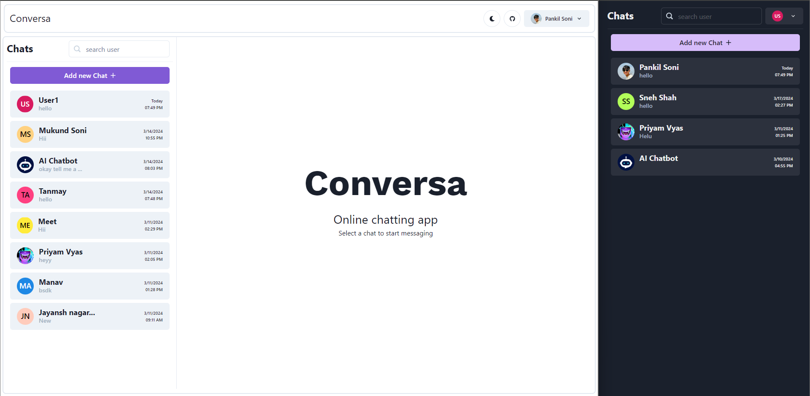
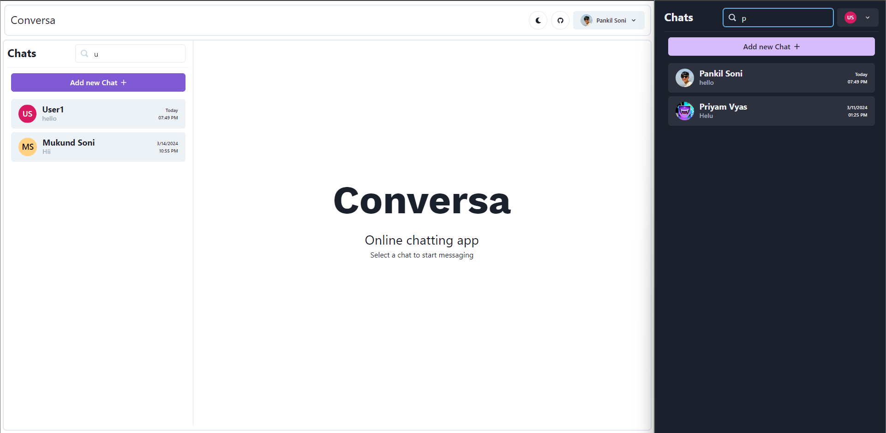

<div align="left" style="position: relative;">
  
<div style="display: flex; justify-content: space-between; align-items: center; width: 100%;">
  <div>
    <h1>Conversa - MERN Chatting Application</h1>
    <em>Connect, Code, Converse - Anywhere, Anytime with MERN Chat App!</em>
    <p>A full-stack MERN (MongoDB, Express.js, React.js, Node.js, Socket.IO) online chatting application 💬</p>
  </div>
</div>
	
### Conversa is a chat-app with various features like:
-   🔐 **Authentication**:  
    ✨ SignUp,
    🔑 Login
    
-   🎨 **Styling/Theming**:  
    🌐 A fully responsive app,  
    🌙 Dark and ☀️ Light mode.
    
-   🤖 **Personalized AI Chatbot**:  
    🧠 Remembers the context for personalized interactions.
    
-   🌐 **Web Sockets**:  
    💬 Real-time chatting,  
    🔔 Message Notifications,  
    🖋️ Real-Time Typing Animation,  
    ❌ Message Deletion,  
    🟢 Active Now / ⌛ Last Seen status tracking,  
    ✅ Message Seen status

</p>

<p align="left">Built with the tools and technologies:</p>
<p align="left">
	
   [](https://nodejs.org/) [](https://developer.mozilla.org/en-US/docs/Web/HTML) [](https://expressjs.com/) [](https://socket.io/)   [](https://www.docker.com/) 
</p>
</div>

**Guest User login accounts:**
```
username : guest123@gmail.com, guest256@gmail.com
password: Welcome@123
```

---

## 🔗 Table of Contents

- [📍 Overview](#-overview)
- [👾 Features](#-features)
- [📁 Project Structure](#-project-structure)
  - [📂 Project Index](#-project-index)
- [🚀 Getting Started](#-getting-started)
  - [☑️ Prerequisites](#-prerequisites)
  - [⚙️ Installation](#-installation)
  - [🤖 Usage](#-🤖usage)
  - [🧪 Testing](#-🧪testing)
- [📌 Project Roadmap](#-project-roadmap)
- [🔰 Contributing](#-contributing)
- [🎗 License](#-license)
- [📝 About the Author](#-about-the-author)
- [🙌 Acknowledgments](#-acknowledgments)

---

## 📍 Overview

The MERN-Chat-App is a cutting-edge solution designed to streamline real-time communication. It leverages the MERN stack (MongoDB, Express.js, React, and Node.js) to offer a robust, scalable chat application. Key features include real-time communication with features like other trending social media applications and seamless integration with cloud services like AWS S3, Google Cloud's AI.

## 📸 Screenshots

<table>
  <tr>
    <td>
      
    </td>
    <td>
      
    </td>
  </tr>
  <tr>
    <td align="center">Dark/Light Mode and Responsive Website</td>
    <td align="center">Authentication</td>
  </tr>
  <tr>
    <td>
      
    </td>
    <td>
      
    </td>
  </tr>
  <tr>
    <td align="center">Responsive Dashboard</td>
    <td align="center">New Chat</td>
  </tr>
  <tr>
    <td>
      
    </td>
    <td>
      
    </td>
  </tr>
  <tr>
    <td align="center">Smooth Searching</td>
    <td align="center">Chatting Area & Real-time Communication</td>
  </tr>
  <tr>
    <td>
      
    </td>
  </tr>
  <tr>
    <td align="center">New Message Real-time Notification</td>
  </tr>
  <tr>
    <td>
      
    </td>
    <td>
      
    </td>
  </tr>
  <tr>
    <td align="center">Message Management</td>
    <td align="center">Active Now Status</td>
  </tr>
  <tr>
    <td>
      
    </td>
  </tr>
  <tr>
    <td align="center">Message Seen Status</td>
  </tr>
  <tr>
    <td>
      
    </td>
    <td>
      
    </td>
  </tr>
</table>


---

## 👾 Features

|      | Feature         | Summary       |
| :--- | :---:           | :---          |
| ⚙️  | **Architecture**  | <ul><li>Utilizes a MERN stack, integrating MongoDB, Express.js, React, and Node.js.</li><li>Backend designed to interact with cloud services like AWS S3 and Google Cloud's AI services.</li><li>Microservices architecture potential, suitable for scalable, distributed systems.</li></ul> |
| 🔩 | **Code Quality**  | <ul><li>Structured project with separate directories for backend and frontend.</li><li>Consistent use of JavaScript across the project.</li><li>Includes a `secrets.js` for managing environment variables, enhancing maintainability.</li></ul> |
| 📄 | **Documentation** | <ul><li>Documentation includes detailed install and usage commands.</li><li>Usage of badges in documentation for visual enhancement and clarity.</li><li>Language distribution shows a heavy use of JavaScript, ensuring consistency.</li></ul> |
| 🔌 | **Integrations**  | <ul><li>Integrates with npm for package management.</li><li>Backend interacts with AWS S3 and Google Cloud services.</li><li>Potential for integration with other cloud-based services or APIs due to its flexible backend.</li></ul> |
| 🧩 | **Modularity**    | <ul><li>Clear separation between frontend and backend codebases.</li><li>Modular structure aids in the maintainability and scalability of the project.</li><li>Use of JSON for configuration and inter-component communication enhances modularity.</li></ul> |
| 🧪 | **Testing**       | <ul><li>Includes npm scripts for testing, though detailed testing strategies are not specified.</li><li>Use of `npm test` suggests integration with JavaScript testing frameworks.</li><li>Testing likely focuses on backend services given the project's structure.</li></ul> |
| ⚡️  | **Performance**   | <ul><li>Use of Node.js and React suggests a focus on high-performance, non-blocking I/O operations.</li><li>Cloud integrations imply readiness for high-load environments.</li><li>Efficient dependency management through `package-lock.json` ensures consistent performance across environments.</li></ul> |
| 🛡️ | **Security**      | <ul><li>Management of secrets via `secrets.js` enhances security.</li><li>Dependency on secure cloud services like AWS S3 and Google Cloud.</li><li>Further security practices and configurations are not detailed but are crucial for future development.</li></ul> |
| 📦 | **Dependencies**  | <ul><li>Heavy reliance on npm for both frontend and backend dependencies.</li><li>Use of `package-lock.json` to lock down versions for consistency.</li><li>Dependencies suggest a robust setup with cloud services integration.</li></ul> |

---

## 📁 Project Structure

```sh
└── mern-chat-app/
    ├── LICENSE
    ├── README.md
    ├── backend
    │   ├── Controllers
    │   │   ├── auth_controller.js
    │   │   ├── conversation_controller.js
    │   │   ├── message_controller.js
    │   │   └── userController.js
    │   ├── Models
    │   │   ├── Conversation.js
    │   │   ├── Message.js
    │   │   └── User.js
    │   ├── README.md
    │   ├── Routes
    │   │   ├── auth_routes.js
    │   │   ├── conversation_routes.js
    │   │   ├── message_routes.js
    │   │   └── userRoutes.js
    │   ├── config
    │   │  
    │   ├── db.js
    │   ├── index.js
    │   ├── middleware
    │   │   └── fetchUser.js
    │   ├── package-lock.json
    │   ├── package.json
    │   ├── secrets.js
    │   ├── socket
    │   │   ├── handlers.js
    │   │   └── index.js
    │   └── uploads
    ├── frontend
    │   ├── README.md
    │   ├── package-lock.json
    │   ├── package.json
    │   ├── public
    │   │   ├── android-chrome-192x192.png
    │   │   ├── android-chrome-512x512.png
    │   │   ├── apple-touch-icon.png
    │   │   ├── favicon-16x16.png
    │   │   ├── favicon-32x32.png
    │   │   ├── favicon.ico
    │   │   ├── index.html
    │   │   ├── manifest.json
    │   │   └── robots.txt
    │   └── src
    │       ├── App.css
    │       ├── App.js
    │       ├── App.test.js
    │       ├── assets
    │       │   └── newmessage.wav
    │       ├── components
    │       │   ├── Authentication
    │       │   ├── Dashboard
    │       │   ├── Home.js
    │       │   ├── Navbar
    │       │   └── miscellaneous
    │       ├── context
    │       │   ├── appState.js
    │       │   └── chatContext.js
    │       ├── index.css
    │       ├── index.js
    │       ├── reportWebVitals.js
    │       ├── setupTests.js
    │       └── typingAnimation.json
    └── screenshots
        ├── 10_login_otp.png
        ├── 1_home.png
        ├── 2_login_signup.png
        ├── 3_dashboard.png
        ├── 4_newchat.png
        ├── 5_searching.png
        ├── 6_chatting_area.png
        ├── 8_delete_message.png
        ├── banner.png
        ├── new_message.png
        └── typing_animation.png
```
## 🚀 Getting Started

### ☑️ Prerequisites

Before getting started with chat-app, ensure your runtime environment meets the following requirements:

- **Version Controller** Git
- **Programming Language:** JavaScript/Node.js
- **Package Manager:** Npm

### ⚙️ Installation

Install chat-app using one of the following methods:

**Build from source:**

1. Clone the chat-app repository:
	```
	git clone https://github.com/suman12378/chat-app
	```

2. Navigate to the project directory:
	```
	cd chat-app
	```

3. Setup Backend
	- Install Dependencies
	    ```
	    cd backend
	    npm install
	    ```
   - Setup Environment: Create a **.env** file in the backend folder and add necessary environment variables.
	    ```
	    PORT=5051
	    MONGO_URI = ""
	    JWT_SECRET = ""
	    ```
    
4. Setup Frontend
	- Install Dependencies
	    ```
	    cd frontend
	    npm install
	    ```

### 🤖 Usage
Run chat-app using the following command:
**Using `npm`** &nbsp; [](https://www.npmjs.com/)

1. Start the backend server:
    ```
    cd backend
    npm run start
    ```
2. Start the frontend development server:
    ```
    cd frontend
    npm run start
    ```
---

## 🎗 License

This project is licensed under the MIT License and Free to use.

## 📝 About the Author
This project was developed by  me (**Suman Thakur**). Feel free to reach out with any questions or suggestions.
- gmail - suman931980@gmail.com

## 🙌 Acknowledgments

- List any resources, contributors, inspiration, etc. here.
